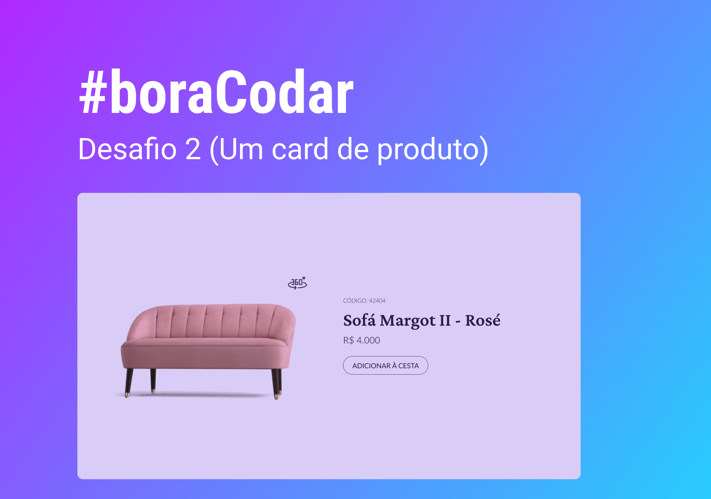

<h1 align="center"> Desafio da Rocketseat </h1>

Desafio #boraCodar Projeto 02.

  <a href="#-tecnologias">Tecnologias</a>&nbsp;&nbsp;&nbsp;|&nbsp;&nbsp;&nbsp;
  <a href="#-projeto">Projeto</a>&nbsp;&nbsp;&nbsp;|&nbsp;&nbsp;&nbsp;
  <a href="#memo-licença">Licença</a>

  

 

  

## 🚀 Tecnologias

Esse projeto foi desenvolvido com as seguintes tecnologias:

- HTML e CSS
- JavaScript
- Git e Github

## 💻 Projeto

Site desenvolvido na semana do desafio #boraCodar um card de produto | Desafio 02 contendo uma imagem de sofá em 360º graus  .

 

- Código desenvolvido por Carlos  -  [Github](https://github.com/Dev-carlosEduardo)
- Sobre o desafio - [Site do desafio](https://boracodar.dev/) | [Protótipo no figma](https://www.figma.com/file/syMdapShjKLpja2yqp35TX/%23boraCodar---Desafio-2-(Community)?node-id=0%3A1&t=8A2wPBUki09HnrU4-0)